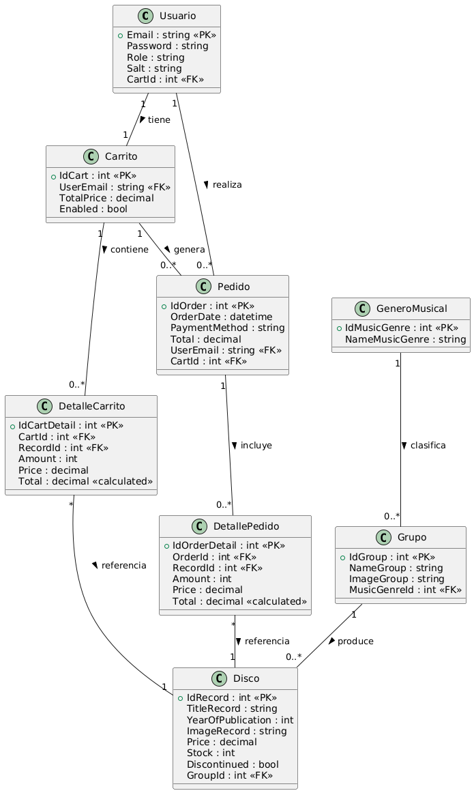
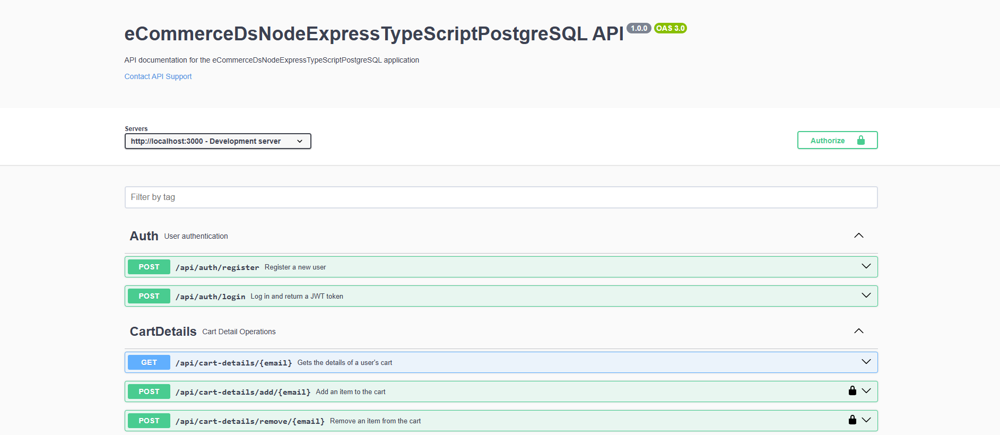
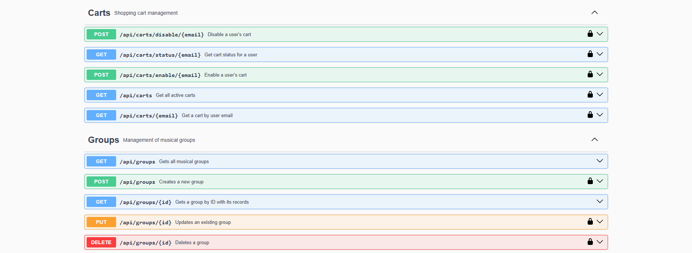
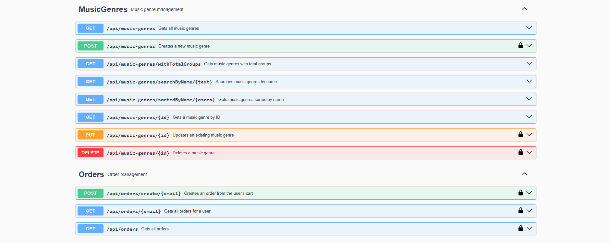
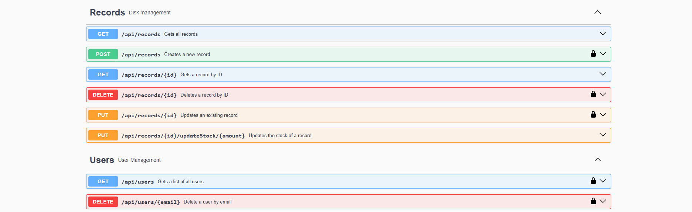
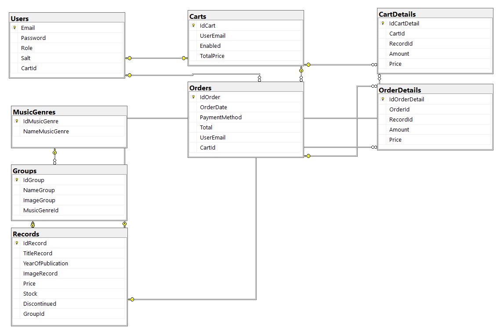

## eCommerceDsNodeExpress_TypeScriptPostgreSQL

**eCommerceDsNodeExpress_TypeScriptPostgreSQL** is an Nodejs+Express API project. It is the backend service layer for an e-commerce application, focused on data management. The Repository implements the data access logic. The Services contain the application's business logic. Key features implemented in the project include: Authentication and Authorization, User Management, Catalog Management, Shopping Cart Management, and Order Management.



eCommerceDsNodeExpress_TypeScriptPostgreSQL/    
├── src/      
│   ├── config/     
│   │      ├── database.ts     
│   │      ├── swagger.ts    
│   ├── controllers/     
│   │      ├── authController.ts     
│   │      ├── cartDetailsController.ts    
│   │      ├── cartsController.ts    
│   │      ├── groupsController.ts  
│   │      ├── musicGenresController.ts  
│   │      ├── ordersController.ts  
│   │      ├── recordsController.ts    
│   │      └── usersController.ts    
│   ├── middleware/     
│   │      ├── authMiddleware.ts     
│   │      └── uploadMiddleware.ts   
│   ├── models/    
│   │      ├── associations.ts     
│   │      ├── Cart.ts    
│   │      ├── CartDetail.ts    
│   │      ├── Group.ts    
│   │      ├── index.ts    
│   │      ├── MusicGenre.ts    
│   │      ├── Order.ts    
│   │      ├── OrderDetail.ts    
│   │      ├── Record.ts    
│   │      └── User.ts    
│   ├── routes/     
│   │      ├── authRoutes.ts     
│   │      ├── cartDetailsRoutes.ts    
│   │      ├── cartsRoutes.ts    
│   │      ├── groupsRoutes.ts    
│   │      ├── musicGenreRoutes.ts   
│   │      ├── ordersRoutes.ts   
│   │      ├── recordsRoutes.ts   
│   │      └── usersRoutes.ts    
│   ├── services/     
│   │      ├── cartDetailService.ts     
│   │      ├── cartService.ts    
│   │      ├── groupService.ts    
│   │      ├── musicGenreService.ts    
│   │      ├── orderService.ts   
│   │      ├── recordService.ts   
│   │      └── userService.ts    
│   └─ server.ts    
├── .env  
├── package.json  
└── tsconfig.json  







## database.ts
```ts 
const dbConfig = {
  database: process.env.DB_NAME || "eCommerceDs",
  username: process.env.DB_USERNAME || "*",
  password: process.env.DB_PASSWORD || "*",
  host: process.env.DB_HOST || "localhost",
  port: parseInt(process.env.DB_PORT || "5432"),
  dialect: "postgres" as const,
  logging: process.env.NODE_ENV !== "production" ? console.log : false,
  define: {
    timestamps: false, // Disable timestamps globally
    freezeTableName: true,
    underscored: false,
  },
  pool: {
    max: 5,
    min: 0,
    acquire: 30000,
    idle: 10000,
  },
};
``` 



[DeepWiki moraisLuismNet/eCommerceDsNodeExpress_TypeScriptPostgreSQL](https://deepwiki.com/moraisLuismNet/eCommerceDsNodeExpress_TypeScriptPostgreSQL)